# 👋 Hey there! I'm Vipul Yadav | こんにちは！私はVipul Yadavです

<div align="center">
  
 
  
  
  
  [](https://www.linkedin.com/in/vipul-yadav-326995351)
  [](https://www.salesforce.com/trailblazer/xdjeip4d0l68vulxrr)
  [](https://www.instagram.com/vipulyadav_02)
  
</div>

---

## 🚀 About Me

```typescript
const vipul = {
    role: "B.Tech IT Student & Full Stack Developer",
    location: "India 🇮🇳",
    specialization: ["Salesforce Development", "Web Development", "Problem Solving"],
    currentlyLearning: ["Cloud Technologies", "Advanced DSA", "System Design"],
    funFact: "I debug code faster than I debug my life! 😄",
    philosophy: "Clean code is not written by following a set of rules, it's a mindset"
};
```

## 🛠️ Tech Arsenal

<div align="center">

### ☁️ Salesforce Ecosystem


### 🌐 Frontend Technologies


### 💻 Backend & Programming


</div>

## 🎓 Education

**B.Tech IT** - *Nov 2022 - Nov 2026*
- **IMS Engineering College Ghaziabad** | Average GPA: 7.21/10
- Pursuing Bachelor of Technology in Information Technology

**Intermediate** - *Aug 2020 - Oct 2021*
- **Bhagirath Public School**
- Completed with excellent academic performance

## 🏆 Achievements & Highlights

<div align="center">

### 🌟 Competition & Contest Achievements
| 🏆 Award/Recognition | 📅 Year | 🎯 Details |
|:---:|:---:|:---:|
| **Grand Finalist** | 2025 | NAVONMESH: Aldea Challenge 2025 |
| **2nd Position** | 2024 | Build & Win Competition, Annual College Fest "Vibgyor" |

### 💼 Technical Skills & Experience
| 🎓 Education | ⚡ Skills | 🌟 Experience |
|:---:|:---:|:---:|
| B.Tech IT Student | Full Stack Development | Salesforce Projects |


</div>

## 🎯 What I'm Up To

```mermaid
graph LR
    A[🔍 Job Hunting] --> B[Salesforce Developer Roles]
    C[📚 Learning] --> D[Japanese language]
    E[💻 Building] --> F[React Applications]
    I[🏆 Practicing] --> J[DSA & Problem Solving]
```



### Current Goals 2024
- 🔍 **Seeking**: Salesforce Developer opportunities
- 📚 **Learning**: Advanced cloud architectures & system design
- 💻 **Building**: Full-stack applications with modern tech stacks
- 🤝 **Open to**: Collaborations on innovative projects
- 🏆 **Improving**: Competitive programming skills

## 💼 Professional Interests

<table align="center">
<tr>
<td align="center" width="200px">

<br><strong>Salesforce Development</strong>
<br>Apex, LWC, Administration
</td>
<td align="center" width="200px">

<br><strong>Frontend Development</strong>
<br>React, Modern CSS, UI/UX
</td>
<td align="center" width="200px">

<br><strong>Backend Systems</strong>
<br>Java, Database Design, APIs
</td>
</tr>
</table>

## 🌱 Learning Journey

```javascript
const learningPath = {
    2024: {
        focus: "Salesforce Development & Full Stack",
        technologies: ["Apex", "LWC", "React", "System Design"],
        goals: ["Salesforce Certification", "Industry Projects", "Open Source Contributions"]
    },
    nextUp: {
        cloudTech: ["AWS", "Azure", "Docker"],
        advanced: ["Microservices", "GraphQL", "TypeScript"],
        specialization: "Enterprise Solutions Architecture"
    }
};
```

## 💬 Let's Connect!

<div align="center">

**I'm always excited to discuss:**
- 💼 Career opportunities in Salesforce development
- 🚀 Innovative web development projects
- 🤝 Collaboration on meaningful tech solutions
- 💡 Latest trends in cloud technologies

*"The best code is not just functional, it's elegant and maintainable"* ✨

</div>

---
---
<div align="center">
  
⭐️ **From [Vipul Yadav](https://github.com/quantumNexus0)** - *Crafting digital solutions, one commit at a time* 🚀
⭐️ **[Vipul Yadav](https://github.com/quantumNexus0)より** - *一つ一つのコミットでデジタルソリューションを作り上げています* 🚀


  
</div>
